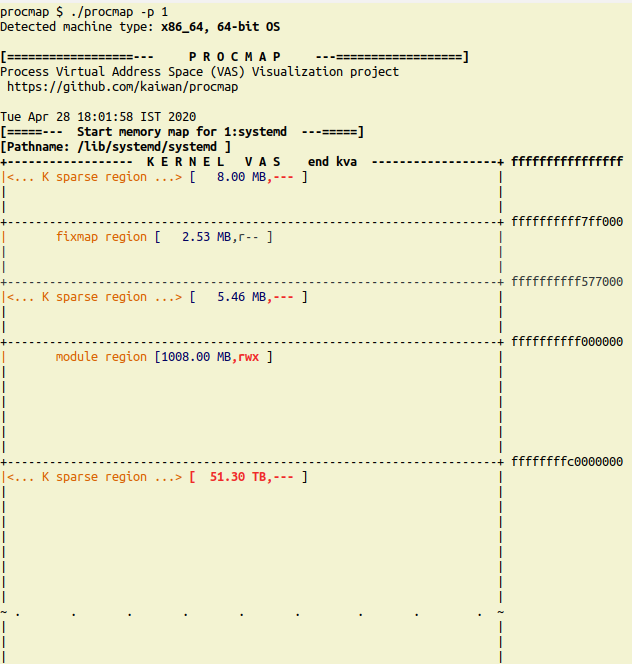
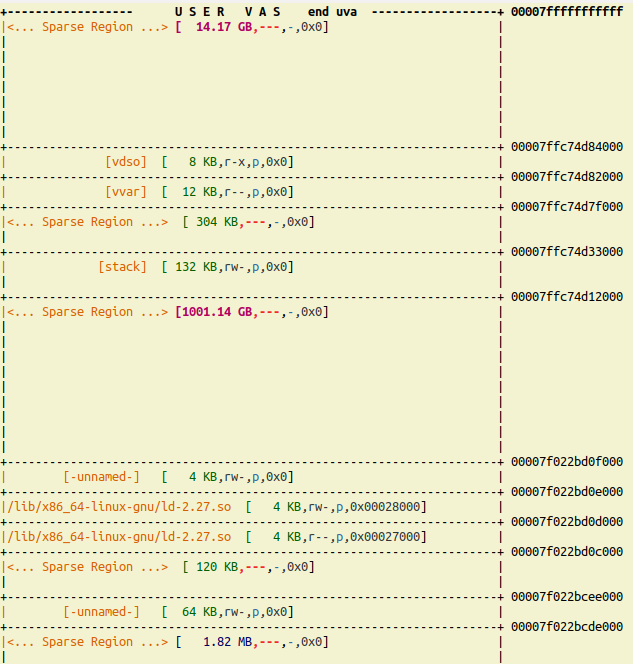
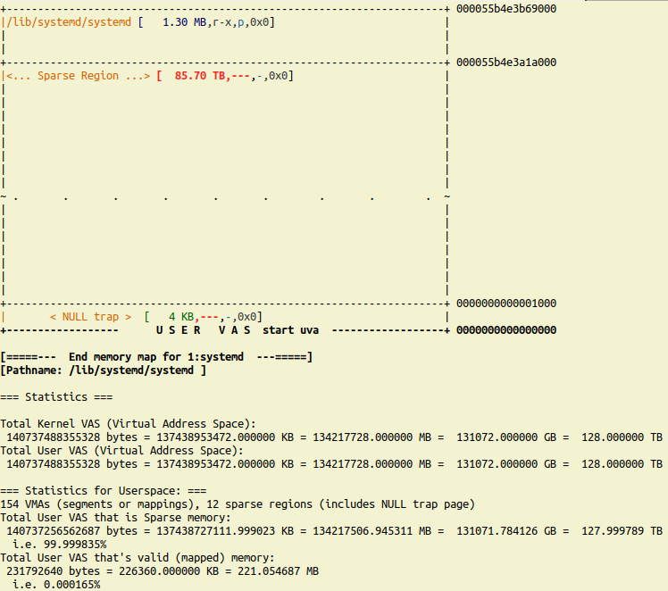

# procmap
***procmap* is designed to be a console/CLI utility to visualize the complete memory map of a Linux process, in effect, to visualize the memory mappings of both the kernel and usermode Virtual Address Space (VAS).**

It outputs a simple visualization of the complete memory map of a given process in a vertically-tiled format **ordered by descending virtual address** (see **screenshots** below). The script has the intelligence to show kernel and userspace mappings as well as calculate and show the sparse memory regions that will be present. Also, each segment or mapping is (very approximately) scaled by relative size and color-coded for readability. On 64-bit systems, it also shows the so-called non-canonical sparse region or 'hole' (typically close to a whopping 16,384 PB on the x86_64).

***Usage:***

> $ ./procmap

Usage: procmap [options] --pid=PID-of-process-to-show-memory-map-of

Options:

 --only-user     : show ONLY the usermode mappings or segments (not kernel VAS)
 
 --only-kernel   : show ONLY the kernel-space mappings or segments (not user VAS)
 
  [default is to show BOTH]

 --locate=<start-vaddr>,<length_KB> : locate a given region within the process VAS

       start-vaddr : a virtual address in hexadecimal
       length : length of the region to locate in KB

 --export-maps=filename
 
     write all map information gleaned to the file you specify in CSV (note that it overwrites the file)
 --export-kernel=filename
     write kernel information gleaned to the file you specify in CSV (note that it overwrites the file)

 --verbose       : verbose mode (try it! see below for details)
 
 --debug         : run in debug mode
 
 --version|--ver : display version info.
 
...

$ 

***How does it work?***

**In a nutshell, kernel-space:**

The kernel memory map is garnered via the kernel component of this project - a *Loadable Kernel Module*. It collates all required information and makes that info available to userspace via a common interfacing technique - a debugfs (pseudo) file. Particulars:

Assuming the debugfs filesystem is mounted at /sys/kernel/debug, the kernel module sets up a debugfs file here:
` /sys/kernel/debug/procmap/disp_kernelseg_details`

Reading this file generates the required kernel information, which the scripts interpret and display.

**In a nutshell, userspace:**

The userspace memory map is collated and displayed by iterating over the `/proc/PID/maps` pseudo-file of the given process.

For both kernel and userspace, the procmap script color-codes and shows the following details (comma separated) for each segment (or mapping):

  * the start user virtual address (uva) to the right extreme of the line seperator
 - the segment name
 - it's size (appropriately, in KB/MB/GB/TB)
 - it's mode (permissions; highlights if null or .WX for security)
 - the type of mapping (p=private, s=shared) (only userspace)
 - if a file mapping, the offset from the beginning of the file (0x0 for anonymous or starts at BOF) (only userspace)

To aid with visualization of the process VAS, we show the relative vertical "length" of a segment or mapping via it's height (of course, it's a highly approximate measure).

The script works on both 32 and 64-bit Linux OS (lightly tested, I request more testing and bug/issue reports please!).

***Requirements:***

Kernel:

- Linux kernel 3.0 or later (technically, >= 2.6.12 should work)
- debugfs must be supported and mounted
- proc fs must be supported and mounted
- you should have the rights to build and insmod(8) a third-party (us!) kernel module on your box

User utils:

- bash(1)
- bc(1)
- smem(8)
- build system (make, gcc, binutils, etc)
- common utils typically always installed on a Linux system (grep, ps, cut, cat, getopts, etc)

Also of course, you require *root* access (to install the kernel module (or the CAP_SYS_MODULE capability), and get the details of any process from /proc/PID/<...>).

**Example**

As an example, below, we run our script on process PID 1 on an x86_64 Ubuntu 18.04 Linux box. The resulting putput is pretty large; thus, we show a few (four) partial screenshots below; this should be enough to help you visualize the typical output. Of course, nothing beats cloning this project and trying it out yourself!

[...]

[...]

[...]

[...]

**Note:**

- As of now, we also show some statistics when done:
     - total sizes of kernel and user VAS's
     - the amount and percentage of memory in the userspace VAS that is just 'sparse' (empty; on 64-bit systems it can be very high!) vs the actually used memory amount and percentage
     - total RAM reported by the system
     - memory usage statistics for this process via:
        - ps(1)
        - smem(8)

- As a bonus, the output is logged - appended - to the file log_procmap.txt. Look up this log when done.

[End doc]
